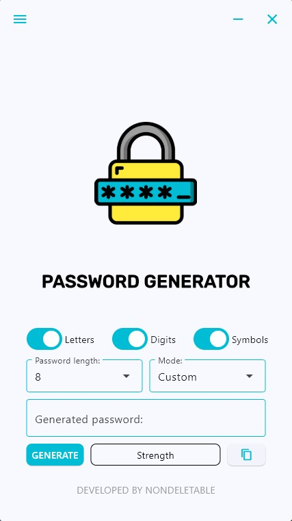
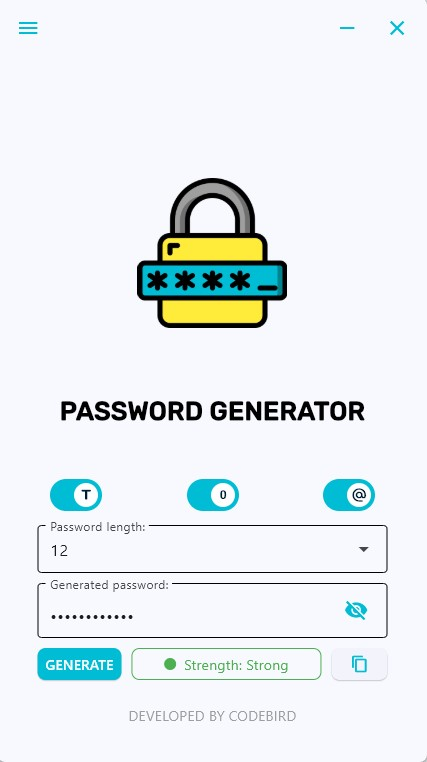

# 🔐 Password Generator

A simple and secure desktop application for generating strong passwords.  
Built with **Python + Flet**, works fully offline, customizable, and includes a built-in strength indicator.

---

## ✨ Features
- Password generation using the [`secrets`](https://docs.python.org/3/library/secrets.html) module (cryptographically secure).
- Flexible configuration: letters, digits, symbols.
- Guaranteed inclusion of at least one character from each selected category.
- Password strength indicator with visual cues (❌ weak / ⚠️ fair / ✅ strong).
- One-click copy to clipboard.
- Clean and modern user interface.

---

## 🛠 Technologies
- **Python 3.13**
- [Flet](https://flet.dev/) — UI framework
- `secrets`, `string` — password generation
- `pytest` — testing
- `ruff`, `black`, `pre-commit` — code style and quality
- `PyInstaller` — build into `.exe`

---

## 🚀 How to Run

### Local development
```bash
git clone https://github.com/SkriptSparrow/PasswordGenerator.git
cd PasswordGenerator
pip install -r requirements-dev.txt
python -m password_gen.ui.main
```

### Run tests
```bash
pytest -v
```

### Build executable locally
```bash
pyinstaller PasswordGenerator.spec --clean
```

### Automatic build

Each release is built automatically with GitHub Actions.
Just tag a new version, e.g.:
```bash
git tag v1.0.0
git push origin v1.0.0
```

and a ready-to-use .exe will appear under Releases.

---

## 📸 Screenshots

Main window:



Password generated:



---

## 📥 Download

👉 You can download the latest .exe build from the [Release](https://github.com/SkriptSparrow/PasswordGenerator/releases/latest) page.

---

## 📬 Contact

👩‍💻 Author: SkriptSparrow
✉️ Email: alexgicheva@gmail.com
💬 Telegram: @Alex_Gicheva

✨ Thank you for using Password Generator! We hope it makes your workflow faster and easier.
