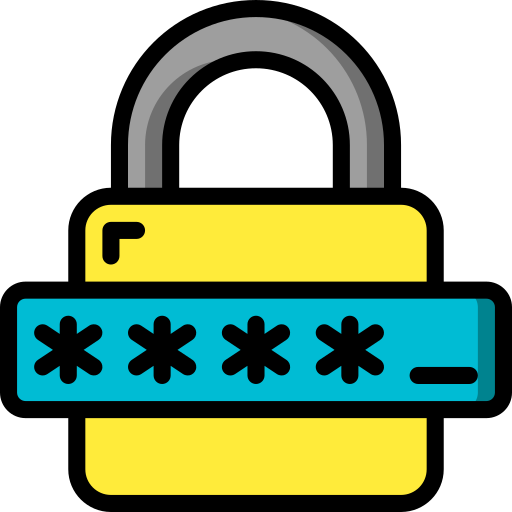

  
<h2>Password Generator</h2>

A clean, offline desktop app for generating strong passwords - fast, configurable, and privacy-first.

  

    <a href="https://github.com/nondeletable/Password-Generator/tree/master/README/README-PG-EN.md">English </a> |  
    <a href="https://github.com/nondeletable/Password-Generator/tree/master/README/README-PG-DE.md">Deutsch </a> |
    <a href="https://github.com/nondeletable/Password-Generator/tree/master/README/README-PG-CN.md">简体中文 </a> | 
    <a href="https://github.com/nondeletable/Password-Generator/tree/master/README/README-PG-VN.md">Tiếng Việt </a> | 
    <a href="https://github.com/nondeletable/Password-Generator/tree/master/README/README-PG-RU.md">Русский </a>
     
     
    
     
     
  

## 🔐 Was diese App macht

- Erzeugt starke Passwörter **offline** (keine Telemetrie, kein Tracking).
- Nutzt sofort einsatzbereite **Richtlinien** (Standard / Admin / NIST).
- Reduziert Copy-&-Paste-Risiken dank **Auto-Ausblenden** und **Clipboard-Auto-Clean**.
- Erstellt Passwörter nach Bedarf (Länge, Symbole, Ziffern usw.).
- Einfach gehalten: portables ".exe", minimalistisches UI, schneller Workflow.
&nbsp;
&nbsp;

## 🎨 Funktionen

- Kryptografisch sichere Generierung mit Python `secrets` (nicht `random`).
- Anpassbare Zeichensets: Buchstaben / Ziffern / Symbole.
- Garantierte Inklusion: mindestens ein Zeichen aus jeder gewählten Kategorie.
- Passwort-Stärkeanzeige (schwach / mittel / stark).
- **Auto-Ausblenden** des angezeigten Passworts nach **10 Sekunden**.
- **Zwischenablage-Schutz**: leert die Zwischenablage nach **30 Sekunden**.
- Kopieren mit einem Klick.
- Integrierte **Passwort-Richtlinien**:
  - **Standard** - ausgewogene Komplexität
  - **Admin** - strengere Regeln für privilegierte Konten
  - **NIST** - angelehnt an NIST SP 800-63B (länger, benutzerfreundlich, sicher)
&nbsp;
&nbsp;

## 😎 Datenschutz & Sicherheit

- ✅ Funktioniert **vollständig offline**.
- ✅ Keine Konten, keine Analytics, keine Telemetrie.
- ✅ Es wird nichts irgendwohin gesendet.
- ✅ Clipboard-Auto-Clean reduziert versehentliche Leaks.
&nbsp;
&nbsp;

## ⚒ Installation

- Gehe zu **Releases** und lade die neueste ".exe" herunter.
- Entpacke sie an einen beliebigen Ort (Desktop, Tools-Ordner, USB-Stick).
- Starte "Password Generator.exe".
&nbsp;
&nbsp;

## 🏓 Verwendung

1. Wähle eine Richtlinie (**Mode**) oder stelle eigene Regeln ein.
2. Aktiviere/deaktiviere Symbole und Ziffern & lege die Passwortlänge fest.
3. Klicke auf **Generate**.
4. Klicke auf **Copy** - die Zwischenablage wird nach 30 Sekunden automatisch geleert.

  

&nbsp;
&nbsp;

## 💾 Technologien

- Python 3.13
- Flet (UI)
- pytest (Tests)
- ruff, black, pre-commit (Quality)
- PyInstaller (Windows builds)
&nbsp;
&nbsp;

## ✅ Qualität

- Testabdeckung: **91%**
- Releases: **4** (Versionen insgesamt: **6**)
- Windows-Build-Größe: ~**83 MB**
&nbsp;
&nbsp;

## ☎ Support & Kontakte

Wenn du zusammenarbeiten oder über eine Jobmöglichkeit sprechen möchtest, nutze einen der Kontakte unten.
Für Support/Bugs bitte Discord oder GitHub Issues verwenden. Ich antworte normalerweise innerhalb von 24 Stunden.

- 🐙 **GitHub** (Docs, Releases, Source Code)  
  https://github.com/nondeletable
- 💬 **Discord** - News, Support, Fragen und Bug-Reports  
  https://discord.com/invite/6nvXwXp78u
- ✈️ **Telegram** - Direktnachrichten  
  https://t.me/nondeletable
- 📧 **E-Mail** - für formelle oder geschäftliche Anfragen  
  nondeletable@gmail.com
- 💼 **LinkedIn** - professionelles Profil  
  https://www.linkedin.com/in/aleksandra-gicheva-3b0264341/
- ☕ **Boosty** - unterstütze meine Arbeit und Projekte mit Spenden  
  https://boosty.to/codebird/donate  
&nbsp;
&nbsp;

Danke, dass du Password Generator benutzt! Ich wünsche dir starke Passwörter und Privatsphäre, die wirklich deine bleibt. 🔐✨🙂
